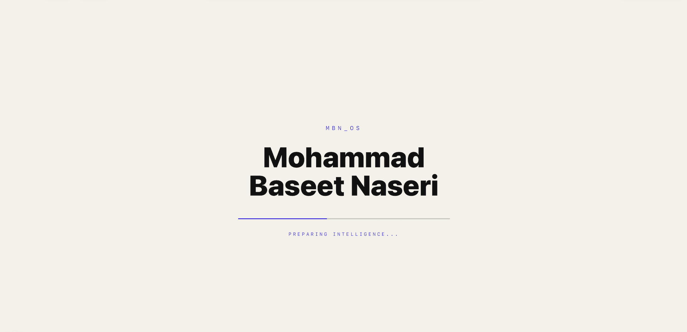
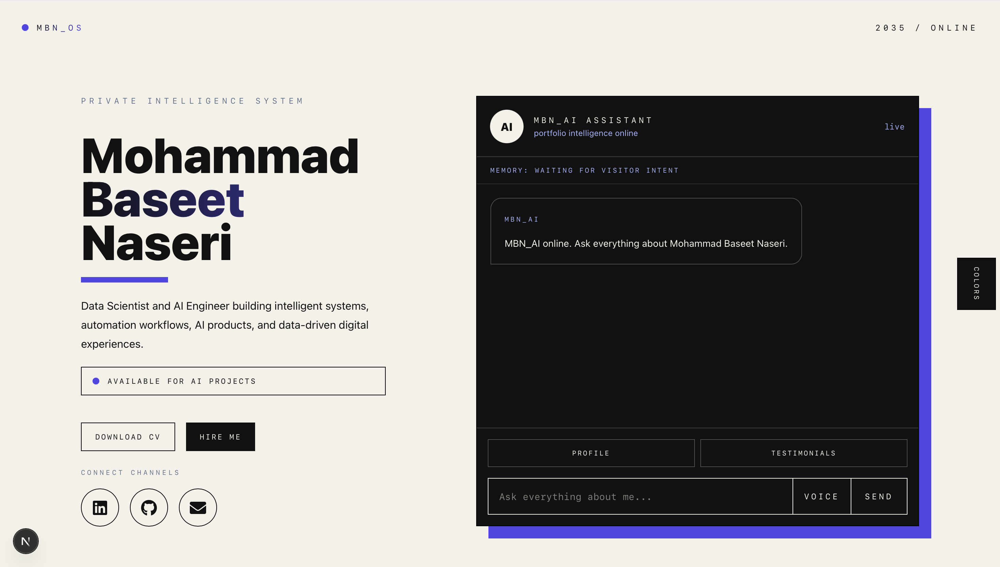
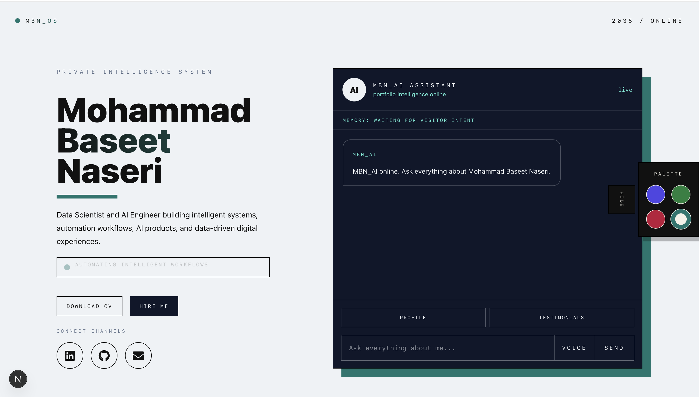
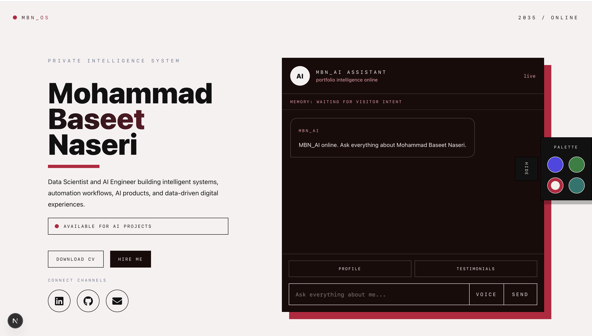
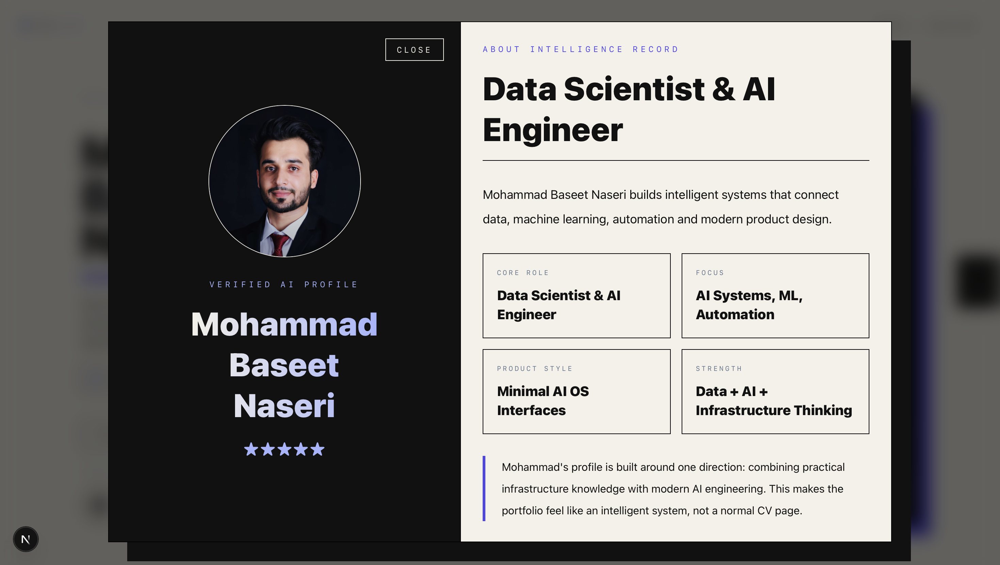
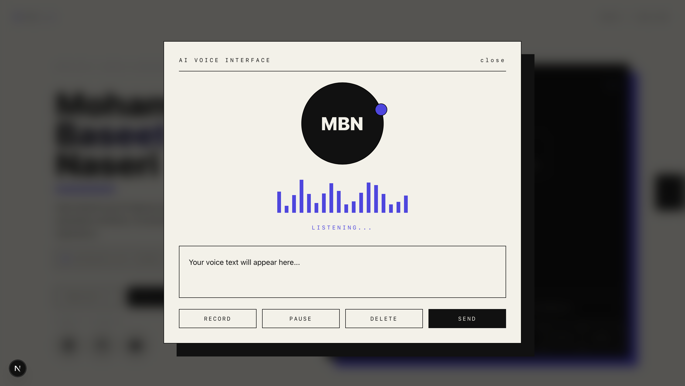
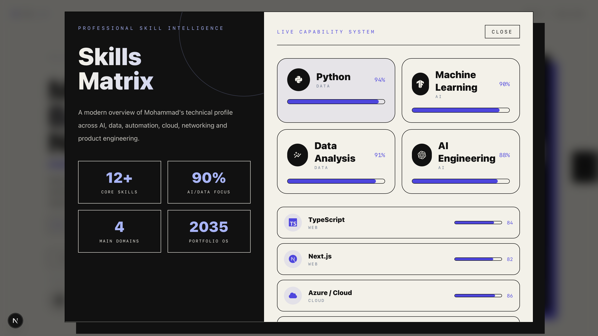
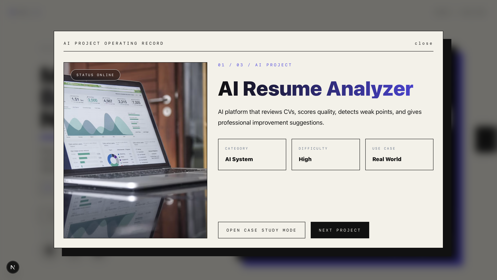

# MBN AI Portfolio

A futuristic AI-powered portfolio designed to feel like a private intelligence system rather than a traditional personal website.

Built with modern web technologies, immersive interactions, intelligent chatbot experiences and a 2035-inspired design language, this portfolio showcases projects, skills, experience, education and AI product thinking through a unique operating system interface.

---

# Preview

### AI Loader

### Main Interface - 01

### Main Interface - 02

### Main Interface - 03

### Professional Profile

### AI Voice Assistant

### Skills Intelligence Matrix

### AI Project Operating System

---

# Overview

MBN AI Portfolio is an advanced portfolio experience designed to showcase the work, skills, projects and professional journey of Mohammad Baseet Naseri.

Unlike traditional portfolio websites, this project introduces an AI-powered interaction model where visitors communicate through an intelligent chatbot interface that acts as the central navigation system.

The platform combines modern design, AI-inspired interactions and immersive user experiences to create a digital identity that feels more like a futuristic operating system than a website.

---

# Features

## AI Chat Assistant

The portfolio is powered by an intelligent chatbot that serves as the primary navigation system.

Visitors can ask about:

- Skills
- Projects
- Experience
- Education
- Testimonials
- Contact Information
- Blog Articles
- Professional Background

The chatbot provides contextual responses and launches relevant interactive modules.

---

## Professional Profile System

The profile section presents:

- Professional biography
- Career overview
- Core expertise
- Social links
- Personal branding
- Technical background

Designed as a modern digital identity card.

---

## Skills Intelligence Matrix

Interactive skills visualization including:

- Data Science
- Machine Learning
- Artificial Intelligence
- Automation
- Cloud Technologies
- Networking
- Programming
- System Design

Features:

- Dynamic progress indicators
- Professional categorization
- Interactive skill exploration
- Theme-aware visualizations

---

## AI Project Operating System

Projects are presented as intelligent records rather than traditional cards.

Each project includes:

- Project overview
- Objectives
- Business value
- Architecture
- AI logic
- Impact analysis
- Future improvements
- Technology stack

---

## Case Study Mode

Every project can be explored through a dedicated case study experience.

Features:

- Full project breakdown
- Technical architecture
- Problem analysis
- Solution strategy
- AI implementation
- Professional presentation layout

---

## AI Voice Assistant

Interactive voice interface featuring:

- Voice input
- Voice visualization
- Message conversion
- AI communication flow

Designed to simulate next-generation conversational interfaces.

---

## Professional Blog System

The platform includes a dedicated blog experience.

Features:

- Full article view
- Professional reading layouts
- Featured images
- Reading insights
- Knowledge sharing
- AI and Data Science content

---

## Testimonial Intelligence System

Professional feedback records including:

- Client testimonials
- Professional recommendations
- Trust indicators
- Visual rating system
- Modern review experience

---

## Dynamic Theme Engine

Users can switch between multiple visual themes.

Features:

- Real-time color changes
- Adaptive interface styling
- Consistent visual language
- Dynamic system-wide updates

---

## Responsive Design

Fully optimized for:

- Desktop
- Laptop
- Tablet
- Mobile Devices

The interface adapts seamlessly across different screen sizes.

---

# Technology Stack

## Frontend

- Next.js
- React
- TypeScript

## Styling

- Tailwind CSS
- Custom Design System
- Responsive Layouts

## Animations

- Framer Motion
- Scroll Interactions
- Dynamic Transitions
- Interactive Micro Animations

## User Experience

- AI Chat Interface
- Voice Interaction System
- Dynamic Theme Engine
- Interactive Popups
- Case Study Navigation

---

# Installation

Clone the repository:

bash git clone https://github.com/baseetnaseri6/mbn-ai-portfolio.git 

Navigate into the project:

bash cd mbn-ai-portfolio 

Install dependencies:

bash npm install 

Start development server:

bash npm run dev 

Open:

text http://localhost:3000 

---

# Future Roadmap

- AI Memory System
- Live Project Analytics
- AI Recommendation Engine
- Interactive Timeline
- Real Voice Conversations
- Multi-language Support
- Advanced AI Assistant
- Project Search Intelligence
- Portfolio Analytics Dashboard
- AI Knowledge Base

---

# Purpose

This project was created to combine design, artificial intelligence, storytelling and personal branding into a single digital experience.

The goal is not only to present projects and skills but to create an intelligent environment where visitors can explore a professional profile through conversation and interaction.

---

# Author

## Mohammad Baseet Naseri

Data Scientist & AI Engineer

- AI Systems
- Machine Learning
- Data Science
- Automation
- Intelligent Product Design

Built with passion for AI, technology and modern user experiences.